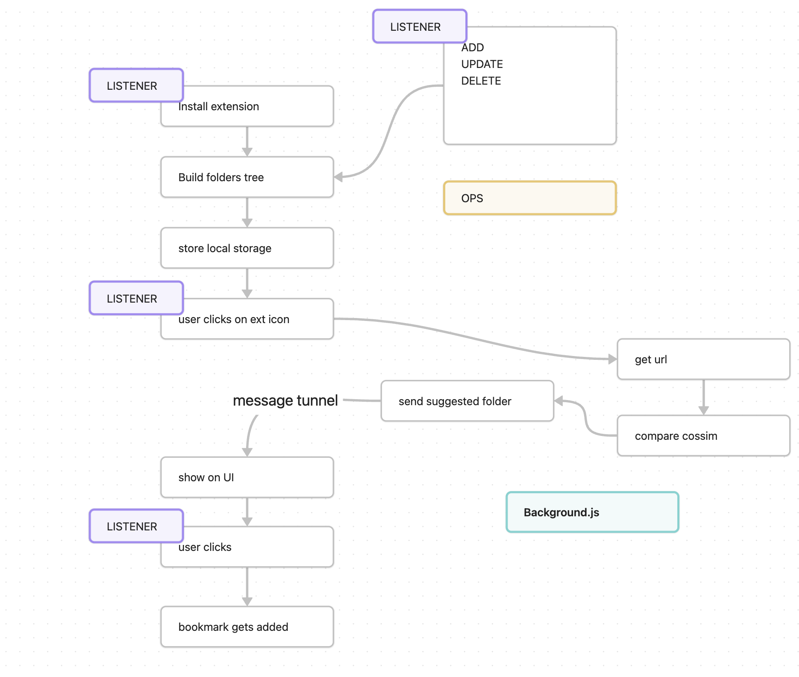
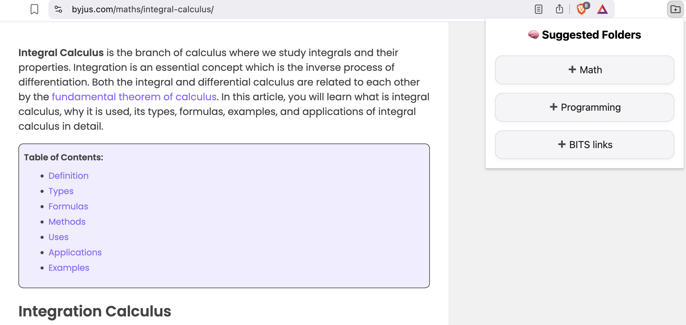

# Blinksort (Beta)- No more manually adding bookmarks into folders

Trying to add a bookmark to a deep nested folder? Blinksort aims to save your time by auto suggesting top three folders which you can add your bookmark to with just a click. And it runs privately on your device!
## How it works:
Blinksort is a lightweight retrieval application that converts and stores your bookmark embeddings locally. When adding a new bookmark, blinksort embeds the query and retrieves top 3 folders having similar bookmarks using cosine similarity.
## Architecture (high-level)

## Getting Started

1. Clone the repo and enter the project directory:

```bash

git clone https://github.com/hirennan/Blinksort.git

cd Blinksort

```

1. Install the necessary dependencies:

```bash

npm install

```

  

1. Build the project:

```bash

npm run build

```

  

1. Add the extension to your browser. To do this, go to `chrome://extensions/`, enable developer mode (top right), and click "Load unpacked". Select the `build` directory from the dialog which appears and click "Select Folder".
2. That's it! You should now be able to open the extension's popup and use start using blinksort!

## Features
- Auto suggests top 3 folders
- Runs locally on device, private
- Saves time from adding to deep nested folders
## Screenshots



## Limitations
Currently uses tab title to store, retrieve embeddings. Sometimes suggested folders can be inaccurate due to this. This can be further enhanced if page content is summarized and used. Future updates can include the latter and better suggest single top folder.
